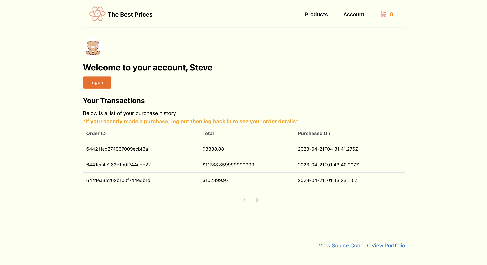

# Lamborghini E-Commerce

## 🛠 Tools Used
* MongoDB
* Express
* Node.js
* React
* Mantine UI

## View Backend Code On Glitch

[View Backend](https://glitch.com/~infsci2560-final-lambo-server)

## ✨ How to Test

### run the project

1. Install node.js on your computer if it doesn't have one
2. run `npm install` in your terminal. Make sure the terminal is at the path of the project.
3. run `npm start` and open `http://localhost:3000`.

### user information
Test out the Admin features:
Email: 609983260@qq.com
Password: 123456

Test out regular user features:
Email: chx53@pitt.edu
Password: 654321

## Screenshots

