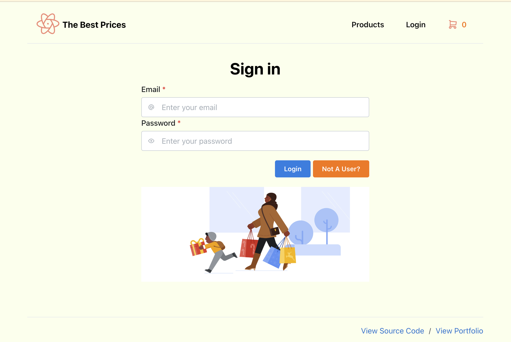
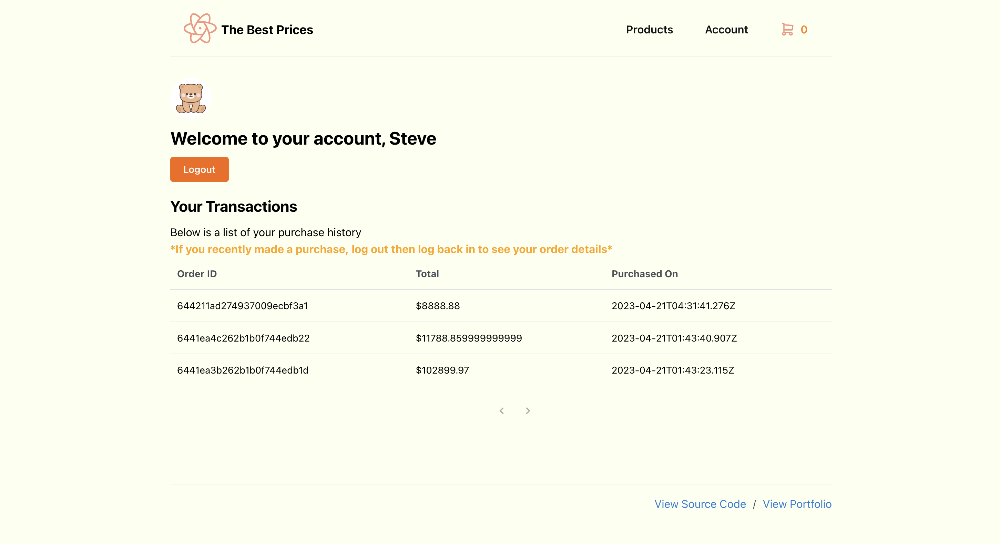
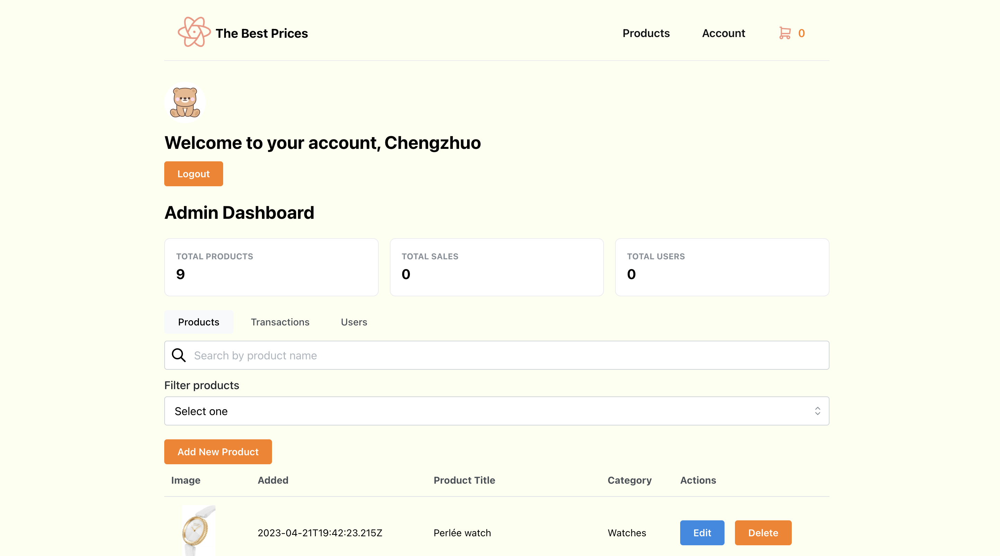

# Lamborghini E-Commerce

## How to Test

### Run the project

1. Install node.js on your computer if it doesn't have one
2. run `npm install` in your terminal. Make sure the terminal is at the path of the project.
3. run `npm start` and open `http://localhost:3000`.

### User information
Test out the Admin features:
Email: 609983260@qq.com
Password: 123456

Test out regular user features:
Email: chx53@pitt.edu
Password: 654321

## View Backend Code On Glitch

[View Backend](https://glitch.com/~infsci2560-final-lambo-server)

## Report

### Introduction
- Introduce the team and provide a high level description of the project. Be sure to include full names and Pitt IDs.

### Objective 
- Describe with more specific details what your objectives and goals are for the project. What problems did you want to solve or what did you want to learn in developing this application? What features, beyond the ones listed in the assignment requirements, did you implement?

### Team member’s contributions 
- Describe in detail what each member of the team did on the project.

### Technical Architecture 
- What are the libraries, frameworks, and other technologies you used and how did you put them together. Use the MVC conceptual model to provide a guide (i.e. what are the models/views/controllers and what do they do).

* MongoDB
* Express
* Node.js
* React
* Mantine UI

### Challenges 
- Discuss any challenges you faced in trying to develop this app. Were there libraries or technologies you wanted to use but we’re frustrating? Where there features you couldn’t get working?

### Future Work 
- What features would you like to add to your application? If you had more time what technologies would you like to learn?

### Conclusion 
- Reflect upon the web technologies and standards you learned in this course, did you learn what you wanted? What technologies or standards do you think would be useful in future iterations of this course?

### Resources 
- List any resources that you used in creating this project (I.e. tutorials, library documentation, or blog posts). Only include resources that are beyond the readings from the course. 

## Screenshots

